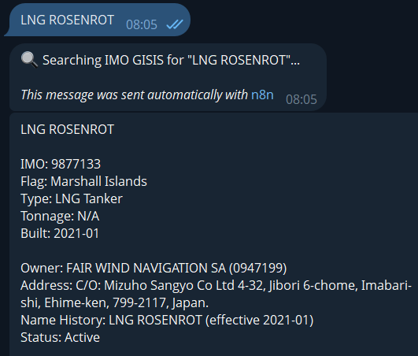

# IMO Ship Information Bot

**A high-performance automated scraping solution that retrieves maritime data from the IMO Global Integrated Shipping Information System (GISIS).**

This project demonstrates an advanced automation workflow that integrates **Telegram**, **n8n**, and **Headless Chrome (Puppeteer)** to bypass complex authentication systems and retrieve relevant data.

---

##  Key Technical Capabilities

###  Advanced Authentication Handling
* **Bypasses ASP.NET Logins:** Automatically handles session cookies, and strict server-side security to authenticate as a registered user.
* **Session Management:** Maintains active sessions across multiple requests to ensure stability.

###  Deep Data Extraction
* **Dynamic Scraping:** Extracts data from hidden dropdowns and dynamic tables.
* **Smart Selectors:** Uses intelligent CSS/XPath selectors that adapt to the legacy ASP.NET structure

### Containerized Architecture
* **Docker & Browserless:** Runs a memory-optimized headless Chrome instance inside Docker to ensure 100% uptime and prevent memory leaks during heavy scraping tasks.
* **n8n Orchestration:** Uses n8n to handle the logic, parsing, and Telegram delivery, making the bot easily extensible.

---

##  Tech Stack

* **Runtime:** Node.js (Puppeteer Core)
* **Orchestration:** n8n (Workflow Automation)
* **Infrastructure:** Docker & Docker Compose
* **Browser:** Browserless / Headless Chrome
* **Interface:** Telegram Bot API

---

##  Workflow Logic

1.  **User Input:** User sends a ship name via Telegram.
2.  **Authentication:** The bot spins up a headless browser and logs into the IMO portal.
3.  **Search & Navigation:** It navigates the internal search engine to find the specific vessel.
4.  **Data Extraction:**
    * Scrapes visible fields (Name, IMO, Type).
    * **Injects JavaScript** to extract hidden historical data and owner details directly from the DOM.
5.  **Delivery:** The parsed JSON data is formatted and sent back to the user instantly.

